# WhatsApp Cruise Control

## Retrieval-Grounded AI WhatsApp Persona Agent

**WhatsApp Cruise Control** is an AI-powered WhatsApp reply agent that uses my previous WhatsApp conversations to generate replies in my own communication style.

Instead of behaving like a generic chatbot, the system retrieves relevant conversation history, identifies the relationship of the sender, applies reply-safety rules, injects my persona style, and then generates a context-aware reply. The final system can connect to WhatsApp through Baileys and send replies automatically, with safety controls such as DRY RUN mode, an allowlist, configurable human-like delays, and a kill switch.

---

## What This Project Does

When a WhatsApp message arrives:

1. Baileys receives the message.
2. The sender's WhatsApp number is used to identify the relationship.
3. The Decision Engine determines whether the agent should reply.
4. Relevant previous conversations are retrieved from ChromaDB.
5. My communication style/persona is added to the generation context.
6. The AI generates a reply.
7. A human-like delay is applied.
8. If LIVE mode is enabled and the sender passes the allowlist check, Baileys sends the reply.

The system is designed so that **cheap rule-based checks happen before AI generation**, reducing unnecessary AI calls and preventing replies to unsuitable messages.

---

## Architecture

```mermaid
flowchart LR

    A[WhatsApp message in] --> B[Router]

    B --> B1[Number extraction]
    B1 --> B2[Relationship lookup]

    B2 --> C[Decision Engine]

    C --> C1[Hard rules]
    C1 --> C2[Signal rules]
    C2 --> C3[Intent check]
    C3 --> C4[Reply policy]

    C4 --> D[Retrieval]

    D --> D1[Query matching relationship's ChromaDB collection]

    D1 --> E[Persona Injection]
    E --> E1[Inject persona context]

    E1 --> F[LLM generation]

    F --> G[Human-like delay]
    G --> H[Baileys send]

    subgraph RULES[Plain rule-based logic - no AI]
        B
        B1
        B2
        C
        C1
        C2
        C3
        C4
        G
    end

    subgraph HISTORY[History brain]
        D
        D1
    end

    subgraph PERSONA[Persona brain]
        E
        E1
    end

    subgraph BOTH[History brain + Persona brain]
        F
    end

    style RULES fill:#f5f5f5,stroke:#666,color:#111
    style HISTORY fill:#dbeafe,stroke:#2563eb,color:#111
    style PERSONA fill:#fce7f3,stroke:#db2777,color:#111
    style BOTH fill:#ede9fe,stroke:#7c3aed,color:#111
```



### Main components

**Router**
Maps a WhatsApp sender number to a relationship such as `family`, `friend`, or `professional`.

**Decision Engine**
Uses rule-based checks and intent detection to decide whether the agent should reply.

**History Brain**
Uses ChromaDB to retrieve relevant previous conversation examples from the sender's relationship-specific collection.

**Persona Brain**
Contains the communication style extracted and authored from my WhatsApp conversations, including tone, phrasing, Hinglish usage, emojis, and relationship-specific behavior.

**LLM Generation**
Combines the retrieved conversation history and persona information to generate the final response.

**Baileys**
Connects the system to WhatsApp Web and handles incoming and outgoing WhatsApp messages.

---

## Project Journey

This project was developed in four stages.

### Week 1 — Persona File

The first stage focused on understanding and representing my communication style.

Work completed:

* Parsed WhatsApp export data.
* Measured style signals such as:

  * Hinglish usage
  * Emoji habits
  * Message length
* Created a relationship-aware persona.
* Added few-shot sample replies.
* Created the persona files used later by the generation system.

The main idea was:

> Use actual conversation data as evidence of my writing style instead of relying only on a description of how I think I communicate.

[Read the Week 1 documentation](docs/WEEK1.md)

---

### Week 2 — History Brain

Week 2 converted WhatsApp history into searchable relationship-specific memory.

Work completed:

* Parsed and cleaned WhatsApp exports.
* Removed unwanted system/media/noise messages.
* Grouped consecutive messages into conversational turns.
* Created `message → reply` pairs.
* Created relationship mappings for historical conversations.
* Generated multilingual embeddings.
* Stored conversation memory in ChromaDB.
* Created separate collections for relationships.
* Tested semantic retrieval.

Current collections include:

```text
history_family
history_friend
history_professional
history_unknown
```

The important design decision was to embed the **incoming message** and store the corresponding reply as metadata. When a new message arrives, the incoming message can therefore be used as the retrieval query.

[Read the Week 2 documentation](docs/WEEK2.md)

---

### Week 3 — Agent Brain

Week 3 connected the major AI components into an actual reply pipeline.

Work completed:

* Created the live relationship map.
* Built the Router.
* Built the Decision Engine.
* Added hard rules and signal rules.
* Added intent checking.
* Added retrieval from relationship-specific ChromaDB collections.
* Added persona-aware generation.
* Built the complete agent pipeline.
* Added batch tests and decision logging.

The resulting flow was:

```text
Router
   ↓
Decision Engine
   ↓
Retrieval
   ↓
Persona + Generation
   ↓
Reply
```

At the end of Week 3, the complete agent pipeline worked in testing, but it was not yet connected to real WhatsApp.

[Read the Week 3 documentation](docs/WEEK3.md)

---

### Week 4 — Go Live

Week 4 connected the agent to WhatsApp and added the safety layer.

Work completed:

* Added a Flask bridge between Node.js and Python.
* Added Baileys WhatsApp integration.
* Added QR-based WhatsApp connection.
* Added a Streamlit monitoring console.
* Added DRY RUN / LIVE mode.
* Added configurable minimum and maximum reply delays.
* Added an independent allowlist check in the Baileys layer.
* Added a repository-level kill switch.
* Added dynamic settings loading.
* Added atomic settings-file writes.
* Added safety checks before sending messages.
* Added `.gitignore` protection for credentials, logs, Chroma data, and the kill-switch file.

The final live architecture is:

```text
WhatsApp
   ↓
Baileys
   ↓
Flask Bridge
   ↓
Router
   ↓
Decision Engine
   ↓
Retrieval + Persona
   ↓
LLM
   ↓
Safety checks
   ↓
Human-like delay
   ↓
Baileys
   ↓
WhatsApp reply
```

[Read the Week 4 documentation](docs/WEEK4.md)

---

## Safety Controls

The system includes several safety mechanisms.

### DRY RUN

The default mode is:

```json
{
  "dry_run": true,
  "min_delay_seconds": 5,
  "max_delay_seconds": 14
}
```

In DRY RUN mode, the system generates the reply but does not send it.

LIVE mode must be deliberately enabled.

---

### Allowlist

Only contacts whose relationship is explicitly configured as something other than `unknown` are allowed to receive automated replies.

The live relationship map is stored in:

```text
config/relationship_map.json
```

---

### Kill Switch

The repository root contains a kill-switch mechanism:

```text
kill_switch.flag
```

When this file exists, WhatsApp processing is skipped.

The Streamlit console provides:

```text
🛑 KILL SWITCH
```

and:

```text
Clear kill switch
```

---

### Human-like Delay

The minimum and maximum reply delay can be configured through:

```text
config/settings.json
```

Example:

```json
{
  "dry_run": true,
  "min_delay_seconds": 5,
  "max_delay_seconds": 14
}
```

The actual delay is randomly selected within the configured range.

---

## Setup

### 1. Clone the repository

```powershell
git clone <YOUR_GITHUB_REPOSITORY_URL>
cd WhatsApp_On-Cruise-Control
```

### 2. Create and activate the Python environment

```powershell
py -3.13 -m venv .venv
.\.venv\Scripts\Activate.ps1
```

### 3. Install Python dependencies

```powershell
python -m pip install --upgrade pip
python -m pip install flask streamlit streamlit-autorefresh
python -m pip install python-dotenv
python -m pip install google-genai
python -m pip install chromadb
python -m pip install sentence-transformers
python -m pip install pytest
```

### 4. Configure the Gemini API key

Create a `.env` file in the project root:

```text
GEMINI_API_KEY=YOUR_API_KEY_HERE
```

Do not commit `.env` to GitHub.

### 5. Install Node.js dependencies

From the project root:

```powershell
npm install
```

The project uses Baileys together with:

* `qrcode-terminal`
* `pino`
* `dotenv`
* `axios`

### 6. Start ChromaDB

ChromaDB must be running before the Python agent performs retrieval.

Open a terminal in the project root:

```powershell
chroma run --path .\chroma_data --port 8000
```

Keep this terminal running.

### 7. Start the Flask bridge

Open another terminal:

```powershell
.\.venv\Scripts\Activate.ps1
python -m agent.bridge
```

The Flask bridge runs on:

```text
http://127.0.0.1:5001
```

### 8. Start the Streamlit console

Open another terminal:

```powershell
.\.venv\Scripts\Activate.ps1
streamlit run .\console\app.py
```

The console normally opens at:

```text
http://localhost:8501
```

### 9. Start Baileys

Open another terminal:

```powershell
node .\whatsapp\baileys_client.js
```

Scan the displayed QR code with the WhatsApp account that will be used for the agent.

---

## Running the System

For a fresh development/testing session, start with:

```text
DRY RUN = ON
```

The main services are:

```text
Terminal 1
→ ChromaDB

Terminal 2
→ Flask bridge

Terminal 3
→ Streamlit console

Terminal 4
→ Baileys
```

Before enabling LIVE mode, verify:

* `kill_switch.flag` does not exist.
* `config/settings.json` has `"dry_run": true` initially.
* The intended contact exists in `config/relationship_map.json`.
* The contact has a non-`unknown` relationship.
* ChromaDB is running.
* Flask is running.
* Streamlit is running.
* Baileys is connected.

---

## Important Files

```text
config/
├── relationship_map.json
├── settings.json
└── settings.py

persona/
├── persona.json
├── style_signals.json
└── sample_outputs.md

ingestion/
├── parse_export.py
├── retrieval.py
├── retrieval_demo.py
└── ...

agent/
├── router.py
├── decision_engine.py
├── generator.py
├── pipeline.py
├── batch_test.py
└── bridge.py

console/
└── app.py

whatsapp/
└── baileys_client.js

docs/
├── architecture_diagram.png
├── architecture_diagram.excalidraw
├── WEEK1.md
├── WEEK2.md
├── WEEK3.md
└── WEEK4.md
```

---

## Privacy

This project is designed to work with personal WhatsApp conversation data.

Do not commit private WhatsApp exports, API keys, authentication credentials, or generated authentication state to the public repository.

The `.gitignore` excludes:

```text
auth_info_baileys/
chroma_data/
logs/
.env
kill_switch.flag
```

---

## Responsible Use

⚠️ **USE RESPONSIBLY**

This project uses Baileys to automate WhatsApp Web interactions. Automated use of WhatsApp may be subject to WhatsApp's terms and policies.

For testing and demonstrations:

* Prefer a dedicated or secondary WhatsApp number rather than a primary personal account.
* Keep message volume low.
* Use human-like delays.
* Only automate conversations where appropriate consent exists.
* Start every fresh session in DRY RUN mode.
* Keep the kill switch available.
* Understand that aggressive or inappropriate automation may result in the WhatsApp account being restricted or banned.

This project is intended for educational, experimental, and controlled demonstration purposes.

---

## Project Status

The four-week project has progressed through:

```text
Week 1
Persona / Style
       ↓
Week 2
Searchable Conversation Memory
       ↓
Week 3
Agent Brain / Decision + Generation
       ↓
Week 4
WhatsApp Integration + Safety Controls
```

The final system combines:

**History Brain + Persona Brain + Rule-based Safety + WhatsApp Integration**

---

## Documentation

Detailed weekly development notes:

* [Week 1 — Persona File](docs/WEEK1.md)
* [Week 2 — History Brain](docs/WEEK2.md)
* [Week 3 — Agent Brain](docs/WEEK3.md)
* [Week 4 — Go Live](docs/WEEK4.md)

---

## Demo

A 60–90 second demonstration should show:

1. Streamlit console in LIVE mode.
2. A consenting test contact sending a real WhatsApp message.
3. Relationship detection.
4. Reply decision and reason.
5. Retrieval results.
6. Generated reply.
7. Actual WhatsApp reply.
8. Returning to the console and activating the Kill Switch.
