```mermaid
flowchart LR
	A[WhatsApp message in] --> B[Router]

	B --> B1[Number extraction]
	B1 --> B2[Relationship lookup]
	B2 --> C[Decision Engine]

	C --> C1[Hard rules]
	C1 --> C2[Signal rules]
	C2 --> C3[Intent check]
	C3 --> C4[Reply policy]
	C4 --> D[Retrieval]

	D --> D1[Query the matching relationship's ChromaDB collection]
	D1 --> E[Persona Injection]

	E --> E1[Inject persona context]
	E1 --> F[LLM generation]
	F --> G[Human-like delay]
	G --> H[Baileys send]

	subgraph RULES[Plain rule-based logic - no AI]
		B
		B1
		B2
		C
		C1
		C2
		C3
		C4
		G
	end

	subgraph HISTORY[History brain]
		D
		D1
	end

	subgraph PERSONA[Persona brain]
		E
		E1
	end

	subgraph BOTH[History brain + Persona brain]
		F
	end

	style RULES fill:#f5f5f5,stroke:#666,color:#111
	style HISTORY fill:#dbeafe,stroke:#2563eb,color:#111
	style PERSONA fill:#fce7f3,stroke:#db2777,color:#111
	style BOTH fill:#ede9fe,stroke:#7c3aed,color:#111
```

------------------------------------------------------------------------
python -m pip install google-genai python-dotenv
-----------------------------------------------------------------------
Write-Host "`n=== VERIFY WEEK 1 PACKAGES ===" -ForegroundColor Cyan
python -m pip list

Write-Host "`n=== VERIFY GOOGLE GENAI ===" -ForegroundColor Cyan
python -c "from google import genai; print('google-genai: OK')"

Write-Host "`n=== VERIFY DOTENV ===" -ForegroundColor Cyan
python -c "from dotenv import load_dotenv; print('python-dotenv: OK')"

-------------------------------------------------------
Write-Host "`n=== 1. PYTHON FILE SYNTAX ===" -ForegroundColor Cyan
python -m py_compile .\test.py
python -m py_compile .\persona\build_persona.py
python -m py_compile .\persona\test_persona.py
Write-Host "Syntax check: PASSED" -ForegroundColor Green

Write-Host "`n=== 2. CHECK WEEK 1 FILES ===" -ForegroundColor Cyan
Get-ChildItem -Recurse -File |
    Where-Object { $_.FullName -notmatch "\\.venv\\" } |
    Select-Object FullName

Write-Host "`n=== 3. CHECK GENERATED PERSONA FILES ===" -ForegroundColor Cyan
Get-ChildItem .\persona -File |
    Select-Object Name, Length

Write-Host "`n=== 4. CHECK RAW EXPORT ===" -ForegroundColor Cyan
Get-ChildItem .\data\raw_export -File -ErrorAction SilentlyContinue |
    Select-Object Name, Length

Write-Host "`n=== 5. VERIFY NO LATER-WEEK PACKAGES ===" -ForegroundColor Cyan
python -m pip list |
    Select-String "chromadb|sentence-transformers|pytest|Flask|streamlit|torch|transformers|onnxruntime|scikit-learn|scipy"

Write-Host "`n=== 6. FINAL DIRECT DEPENDENCIES ===" -ForegroundColor Cyan
python -m pip list |
    Select-String "google-genai|python-dotenv"

-----------------------------------------------------------------------------
Write-Host "`n=== WEEK 1 FINAL CHECK ===" -ForegroundColor Cyan

Write-Host "`n[1] Python + pip" -ForegroundColor Yellow
python --version
python -m pip --version

Write-Host "`n[2] Required packages" -ForegroundColor Yellow
python -m pip list | Select-String "google-genai|python-dotenv"

Write-Host "`n[3] Required files" -ForegroundColor Yellow
Test-Path ".\data\raw_export\family.txt"
Test-Path ".\data\raw_export\friend.txt"
Test-Path ".\data\raw_export\working_group.txt"
Test-Path ".\persona\persona.json"
Test-Path ".\persona\style_signals.json"
Test-Path ".\persona\sample_outputs.md"

Write-Host "`n[4] Python syntax" -ForegroundColor Yellow
python -m py_compile .\test.py
python -m py_compile .\persona\build_persona.py
python -m py_compile .\persona\test_persona.py
Write-Host "Syntax: PASSED" -ForegroundColor Green

Write-Host "`n[5] Run persona test" -ForegroundColor Yellow
python .\persona\test_persona.py

Write-Host "`n[6] Run main test" -ForegroundColor Yellow
python .\test.py

Write-Host "`n=== WEEK 1 CHECK COMPLETE ===" -ForegroundColor Cyan

------------------------------------------------------------------------------
Write-Host "`n=== RUN WEEK 1 TEST ===" -ForegroundColor Cyan
python .\test.py

Write-Host "`n=== RUN PERSONA TEST ===" -ForegroundColor Cyan
python .\persona\test_persona.py

----------------------------------------------------------------------------------------------------------------------
week1/
├── .venv/                    ← CLEAN Week 1 environment
├── .env
├── README.md
├── test.py
├── data/
│   └── raw_export/
│       ├── family.txt
│       ├── friend.txt
│       └── working_group.txt
├── docs/
│   ├── architecture_diagram.png
│   ├── architecture_diagram.excalidraw
│   └── problem_context.md
└── persona/
    ├── build_persona.py
    ├── persona.json
    ├── sample_outputs.md
    ├── style_signals.json
    └── test_persona.py
	
-------------------------------------------------------------------------------