```mermaid
flowchart LR
	A[WhatsApp message in] --> B[Router]

	B --> B1[Number extraction]
	B1 --> B2[Relationship lookup]
	B2 --> C[Decision Engine]

	C --> C1[Hard rules]
	C1 --> C2[Signal rules]
	C2 --> C3[Intent check]
	C3 --> C4[Reply policy]
	C4 --> D[Retrieval]

	D --> D1[Query the matching relationship's ChromaDB collection]
	D1 --> E[Persona Injection]

	E --> E1[Inject persona context]
	E1 --> F[LLM generation]
	F --> G[Human-like delay]
	G --> H[Baileys send]

	subgraph RULES[Plain rule-based logic - no AI]
		B
		B1
		B2
		C
		C1
		C2
		C3
		C4
		G
	end

	subgraph HISTORY[History brain]
		D
		D1
	end

	subgraph PERSONA[Persona brain]
		E
		E1
	end

	subgraph BOTH[History brain + Persona brain]
		F
	end

	style RULES fill:#f5f5f5,stroke:#666,color:#111
	style HISTORY fill:#dbeafe,stroke:#2563eb,color:#111
	style PERSONA fill:#fce7f3,stroke:#db2777,color:#111
	style BOTH fill:#ede9fe,stroke:#7c3aed,color:#111
```

*********************************************************************
Week1 -Session1 Checkpoint:-

Why measure style before creating the persona?
Because actual data is more reliable than describing your own writing style from memory. The script measures things like Hinglish usage, emojis, and message length.
What can make build_persona.py return zero messages?
Usually, the sender name doesn't exactly match the name in the WhatsApp export. Before running it, open the .txt file and check exactly how your name appears.
Why hand-write the persona with Copilot's help?
Style statistics alone cannot describe things like your tone, how you talk to family vs friends, or how you phrase replies. The numbers provide evidence, but the persona needs human-written instructions.
What if replies sound generic?
The fix isn't simply adding better adjectives like "friendly" or "casual." You need more specific examples and rules from your actual writing style—especially few-shot examples.
Why no external emoji package?
Because Python can already detect emojis using Unicode characters/ranges, so installing another package isn't necessary for this task.
-------------------------------------------------------------------------

Week2 -Session1 Checkpoint:-
1. Why don't we parse WhatsApp dates into real date objects?

Because in this session we only need the order of messages, not actual date calculations.

The assignment wants us to know which message came before or after another message and create pairs based on that order. Parsing dates into Python datetime objects would add unnecessary complexity.

Later, when we actually need things like "recent messages", date parsing can be added.

2. Message vs. turn

A message is one individual WhatsApp message.

For example:

Riya: Are you free?
Riya: Coffee chale?

These are two separate messages.

A turn is one or more consecutive messages from the same person grouped together:

Riya:
Are you free?
Coffee chale?

We group messages into turns because conversations naturally happen in turns. We want to pair:

Their turn → My turn

rather than accidentally treating every individual message as a separate conversation exchange.

3. What breaks if the phone language isn't English?

The main problem is system-message detection.

WhatsApp can export system messages differently depending on the phone's language. For example, messages such as:

group creation
encryption notices
missed calls
someone being added
deleted messages

may appear in another language.

Our parser's NOISE_MARKERS contains specific English phrases. If WhatsApp produces the equivalent message in another language, the script might fail to recognize it as noise, so that system message could enter the training pairs.

To find what needs fixing, open the exported .txt file and look for the unexpected system messages. Then add their exact wording to NOISE_MARKERS.

4. Why avoid group chat exports?

Because the pairing logic assumes a 1-to-1 conversation:

Them → Me

A group chat has multiple people:

Rahul → Neha → Pragya → Rahul → Neha

The script could incorrectly treat a message from one group member as the "other person's" message and pair it with Pragya's reply, even though Pragya may have been responding to someone else.

That produces incorrect memory/training pairs.

5. What two things should you check before trusting processed_pairs.jsonl?

The two important checks are:

① Quantity/distribution

Check the total number of pairs and the number of pairs for each conversation.

Your result:

Total pairs: 32
family: 18
friend: 14

This confirms that the parser actually produced data for both conversations.

② Quality/content

Inspect the random sample pairs and check for things that shouldn't be there:

media/system messages
deleted messages
empty messages
excessively long replies
identical messages
obviously incorrect pairings

Your validation ended with:

✅ Looks good

So your Part 4 validation passed.

Your Session 2.1 status

You can mark both deliverables:

[✅] data/processed_pairs.jsonl — 32 clean pairs
[✅] Validated data quality — validation passed

And importantly, Session 2.1 is now complete. 🎉

The note at the bottom means don't submit Week 2 as fully finished yet. Session 2.2 will take processed_pairs.jsonl and turn those pairs into searchable relationship-specific memory using ChromaDB.
--------------------------------------------------------------------------------------------------------

Week2-Session2-
1. python -m pip install "chromadb[server]" sentence-transformers

Start ChromaDB server:
Important: ChromaDB needs to keep running in a separate terminal.
2. chroma run --path .\chroma_data --port 8000

You should see ChromaDB start and listen on port 8000.
curl http://localhost:8000/api/v2/heartbeat
3. curl.exe http://localhost:8000/api/v2/heartbeat

4. python -c "import json; ids=set(); f=open('data/processed_pairs.jsonl', encoding='utf-8'); [ids.add(json.loads(line)['conversation_id']) for line in f]; f.close(); print('\n'.join(sorted(ids)))"

5. New-Item -ItemType Directory -Path .\config -Force
New-Item -ItemType File -Path .\config\contact_relationship_map.json -Force

ALso create file:
week2\ingestion\validate_relationship_map.py
week2\ingestion\embed_to_chroma.py

6. python ingestion\validate_relationship_map.py

python -c "import sklearn; from sentence_transformers import SentenceTransformer; print('sentence-transformers OK')"
python ingestion\embed_to_chroma.py

Part 4 — Embed Into ChromaDB is complete.
| Collection             | Stored pairs | Status   |
| ---------------------- | -----------: | -------- |
| `history_family`       |           18 | ✅        |
| `history_friend`       |           14 | ✅        |
| `history_professional` |            0 | ⚠️ Empty |
| `history_unknown`      |            0 | ⚠️ Empty |
| **Total**              |       **32** | ✅        |

python ingestion\retrieval_demo.py

$env:PYTHONIOENCODING="utf-8"
python ingestion\retrieval_demo.py | Tee-Object retrieval_results.txt

----------------------------------------------------------------------
For Week 2, your work was basically to build the “history brain” of your WhatsApp agent.

Your Week 2 tasks

Parse your WhatsApp history ✅
Convert exported chats into clean:

other person's message → your reply

Clean the data ✅
Remove system messages, media placeholders, one-word acknowledgements, etc.
Group messages into turns ✅
Consecutive messages from the same person are treated as one turn.

Create the relationship map ✅
Your current map:

family → family
friend → friend

with _default → unknown.

Set up ChromaDB ✅
This is where the searchable conversation memory is stored.

Create embeddings ✅
You used:

paraphrase-multilingual-mpnet-base-v2

Separate memories by relationship ✅
You created:

history_family
history_friend
history_professional
history_unknown
Store your old messages and replies ✅
For each pair, the incoming message is embedded, while your reply is stored as metadata.
Test retrieval ✅
Given a new message, the system finds similar previous messages and shows the replies you gave previously.

Save retrieval evidence ✅
You created:

retrieval_results.txt
Your Week 2 flow is now:
WhatsApp Export
      ↓
Parse & Clean
      ↓
Message → Reply Pairs
      ↓
Relationship Map
      ↓
Multilingual Embeddings
      ↓
ChromaDB
      ↓
Family / Friend / Professional / Unknown
      ↓
Retrieval Test
      ↓
Relevant old messages + your old replies

###################################################################

Now let's do Part 7 — Understanding Checkpoint first, because it tests whether you understand what you just built.

Part 7 — Answers

1. Why two relationship maps?

There are two different situations:

config/contact_relationship_map.json → uses the conversation ID/name from historical WhatsApp exports. We use this now in Week 2 to classify old chat history.
config/relationship_map.json → will use the phone number when the live WhatsApp/Baileys system is running. This comes later in Session 3.1.

So they use different identifiers for different stages.

2. Why embed their_message, not my_reply?

Because when a new WhatsApp message arrives, it is their message that we need to search for.

For example:

Their old message: "Babu khana kha liya?"
My old reply:     "Haan kha liya ❤️"

If a new message is:

"Babu khana kha liya?"

we search the stored incoming messages and retrieve the associated reply.

The my_reply is stored as metadata so we can use it after finding the matching historical message.

3. Why load the embedding model only once?

The embedding model is large and expensive to load.

Correct:

Load model
     ↓
Pair 1 → embed
Pair 2 → embed
Pair 3 → embed
...

Wrong:

Pair 1 → load model → embed
Pair 2 → load model → embed
Pair 3 → load model → embed

Reloading it for every pair would make the program extremely slow and waste memory/resources.

4. Why use a stable hash ID?

Your code uses:

stable_id(conversation_id, timestamp, index)

and creates a SHA-256 hash.

That means the same pair gets the same ID when you run the script again.

ChromaDB's upsert() can then update/reuse the existing record instead of creating another copy.

An ordinary counter could cause problems because the ordering of the input could change between runs.

5. What is the Hinglish limitation?

The multilingual model can handle many languages, but romanized Hinglish/code-mixed text isn't its specialized strength.

For example:

"kal movie dekhne chale?"

may not retrieve as accurately as a clean English or Hindi-language equivalent.

That's a retrieval-model limitation, not necessarily a bug in your code.

*********************************WEEK-3*******************************************************************
The Session 3.1 work is only:

Install pytest
Create config/relationship_map.json
Create agent/router.py
Create agent/test_router.py
Create agent/validate_relationship_map.py (recommended)
Run tests
Run validator
Understand the 5 checkpoint questions
Important about phone numbers

Your instructor says to use real phone numbers for the map. Don't paste your real contacts/numbers here. You can enter them directly into your local JSON file.

----------------------------------
Install pytest:
python -m pip install pytest
-----------------------------------
Replace the three placeholders with your actual numbers.in relatinoship_map.json

Run :
python -m json.tool .\config\relationship_map.json
python -m pytest .\agent\test_router.py -v
python .\agent\validate_relationship_map.py
-----------------------------------------------------

Do these checks in this order

1 → Chroma heartbeat
2 → persona JSON
3 → retrieval demo
4 → router tests
5 → locate Gemini key test

curl.exe http://localhost:8000/api/v2/heartbeat
chroma run --path .\chroma_data --port 8000

python -m json.tool .\persona\persona.json
python .\ingestion\retrieval_demo.py
python -m pytest .\agent\test_router.py -v

Get-ChildItem -Path . -Filter quick_key_test.py -Recurse
if not work then run-
Get-ChildItem .env
python -c "from dotenv import load_dotenv; import os; load_dotenv(); print('GEMINI_API_KEY:', 'SET' if os.getenv('GEMINI_API_KEY') else 'NOT SET')"

python -m ingestion.parse_export --name "Pragya"

Create ingestion/retrieval.py

python -c "from ingestion.retrieval import retrieve_similar; print(retrieve_similar('friend', 'yaar kal free hai kya'))"

Replace the entire file etrievaldemo.py with code 
python -m ingestion.retrieval_demo

Create agent\decision_engine.py paste code then run
python -c "from agent.decision_engine import should_reply; print('decision_engine import: OK')"

Now we test the cheap rules first, without unnecessarily calling Gemini.-
python -c "from agent.decision_engine import should_reply; tests=[({'from_me':True,'text':'Hello','message_type':'text','is_forwarded':False},'friend'),({'from_me':False,'text':'Okay','message_type':'text','is_forwarded':False},'friend'),({'from_me':False,'text':'Hello','message_type':'text','is_forwarded':False},'unknown'),({'from_me':False,'text':'Hello','message_type':'image','is_forwarded':False},'friend'),({'from_me':False,'text':'Hello','message_type':'text','is_forwarded':True},'friend')]; [print(should_reply(m,r)) for m,r in tests]"

python -c "from agent.decision_engine import should_reply; print(should_reply({'from_me':False,'text':'','message_type':'image','is_forwarded':False},'friend'))"

python -c "from agent.decision_engine import should_reply; print(should_reply({'from_me':False,'text':'Kal coffee pe milte hain?','message_type':'text','is_forwarded':False},'friend'))"

Get-Content .\logs\decision_log.jsonl
---------------------------------------------------------------------------------------
Create agent\generate.py then paste code then run-
python -c "from agent.generator import generate_reply; print('generator import: OK')"
python -m agent.generator

--------------------------------------------------------------------------------------
Create agent\pipeline.py then paste code then run-
Get-Content .\config\relationship_map.json
python -m agent.pipeline

python -c "from agent.pipeline import process_message; tests=[{'name':'Unknown sender','msg':{'jid':'5555555555@s.whatsapp.net','from_me':False,'text':'Hello','message_type':'text','is_forwarded':False}},{'name':'Group chat','msg':{'jid':'1234567890@g.us','from_me':False,'text':'Hello everyone','message_type':'text','is_forwarded':False}},{'name':'One-word ack','msg':{'jid':'1112223334@s.whatsapp.net','from_me':False,'text':'Okay','message_type':'text','is_forwarded':False}},{'name':'Money message','msg':{'jid':'1112223334@s.whatsapp.net','from_me':False,'text':'Can you send me money?','message_type':'text','is_forwarded':False}}]; [print(f'\n--- {t[\"name\"]} ---'); print(f'Result: {process_message(t[\"msg\"])}') for t in tests]"
---------------------------------------------------------------------------------------
Create agent\batch_test.py then paste code then run-
python -m agent.batch_test
Get-Content .\logs\decision_log.jsonl

Router → Decision Engine → Retrieval → Persona + Generation → dry-run reply

And importantly, nothing is connected to real WhatsApp yet.
#####################################################################################################

*****************************WEEK-4************************************************************************
npm init -y
It creates: package.json

npm view @whiskeysockets/baileys version

npm install @whiskeysockets/baileys@7.0.0-rc14
npm list @whiskeysockets/baileys

npm install qrcode-terminal pino dotenv axios

npm list qrcode-terminal pino dotenv axios

python -m pip install flask streamlit streamlit-autorefresh

python -c "import flask, streamlit, streamlit_autorefresh; print('Week 4 Python dependencies: OK')"

-------------------------------------------------------------------------------------------------------
Craete agent\bridge.py 

Get-Item .\agent\bridge.py
Select-String -Path .\agent\bridge.py -Pattern "Flask|resolve_relationship|should_reply|generate_reply|retrieve_similar|/process|port=5001"

Select-String -Path .\agent\decision_engine.py -Pattern "return " -Context 0,2
Select-String -Path .\agent\decision_engine.py -Pattern "def should_reply" -Context 0,35

------------------------------------
python -m pip install python-dotenv
python -m pip install google-genai
python -c "from google import genai; print('Google GenAI import: OK')"

python -m pip install chromadb
python -c "import chromadb; print('ChromaDB import: OK')"

python -m pip install sentence-transformers
python -c "from sentence_transformers import SentenceTransformer; print('Sentence Transformers import: OK')"
------------------------------------------------------------
chroma run --path .\chroma_data --port 8000
python -c "import agent.bridge; print('Bridge import: OK')"

python -m agent.bridge
-----------------------------------------------
Run also-
Write-Host "Testing Flask bridge..."

$body = @{
    jid = "1112223334@s.whatsapp.net"
    text = "thanks"
    message_type = "text"
    is_forwarded = $false
    from_me = $false
} | ConvertTo-Json

Write-Host "Sending request..."

$response = Invoke-RestMethod `
    -Uri "http://127.0.0.1:5001/process" `
    -Method Post `
    -ContentType "application/json" `
    -Body $body

Write-Host "Response received:"
$response | Format-List
--------------------------------------------
Get-Content .\logs\console_feed.jsonl

------------------------------------------

Create whatsapp\baileys_client.js then paste code then run-
Get-Content .\whatsapp\baileys_client.js | Select-Object -First 20

Write-Host "STEP 1 - Creating test message..."

$body = @{
    jid = "1112223334@s.whatsapp.net"
    text = "thanks"
    message_type = "text"
    is_forwarded = $false
    from_me = $false
} | ConvertTo-Json

Write-Host "STEP 2 - Sending message to Flask..."
Write-Host $body

$response = Invoke-RestMethod `
    -Uri "http://127.0.0.1:5001/process" `
    -Method Post `
    -ContentType "application/json" `
    -Body $body

Write-Host "STEP 3 - Flask response:"
$response | Format-List
------------------------------------------
create console\app.py then paste code
--------------------------------------------
craete config\mode.txt
--------------------------------------------
streamlit run .\console\app.py
---------------------------------------------
Write-Host "Sending normal friend message..."

$body = @{
    jid = "1112223334@s.whatsapp.net"
    text = "Hey, kya kar rahi ho?"
    message_type = "text"
    is_forwarded = $false
    from_me = $false
} | ConvertTo-Json

$response = Invoke-RestMethod `
    -Uri "http://127.0.0.1:5001/process" `
    -Method Post `
    -ContentType "application/json" `
    -Body $body

Write-Host ""
Write-Host "Flask response:"
$response | Format-List
-----------------------------------------
python -c "from agent.decision_engine import intent_check; print('Coffee:', intent_check('Haan yaar, coffee pe chale?')); print('Casual:', intent_check('Hey, kya kar rahi ho?')); print('Money:', intent_check('Can you send me 5000 rupees?'));"
---------------------------------------------------------------------------------------------------------
Restart flask-python -m agent.bridge
---------------------------------------------
$body = @{
    jid = "1112223334@s.whatsapp.net"
    text = "Haan yaar, coffee pe chale?"
    message_type = "text"
    is_forwarded = $false
    from_me = $false
} | ConvertTo-Json

$response = Invoke-RestMethod `
    -Uri "http://127.0.0.1:5001/process" `
    -Method Post `
    -ContentType "application/json" `
    -Body $body

$response | Format-List
-----------------------------------------------
Get-Content .\logs\console_feed.jsonl -Tail 3

Get-Content .\logs\decision_log.jsonl -Tail 3
----------------------------------------------------
update bridge & decision_engine files
-------------------------------------------------
$body = @{
    jid = "1112223334@s.whatsapp.net"
    text = ""
    message_type = "image"
    is_forwarded = $false
    from_me = $false
} | ConvertTo-Json

$response = Invoke-RestMethod `
    -Uri "http://127.0.0.1:5001/process" `
    -Method Post `
    -ContentType "application/json" `
    -Body $body

$response | Format-List
-------------------------------------------------
foreach ($type in @("audio", "video")) {
    $body = @{
        jid = "1112223334@s.whatsapp.net"
        text = ""
        message_type = $type
        is_forwarded = $false
        from_me = $false
    } | ConvertTo-Json

    $response = Invoke-RestMethod `
        -Uri "http://127.0.0.1:5001/process" `
        -Method Post `
        -ContentType "application/json" `
        -Body $body

    Write-Host "`n===== $type ====="
    $response | Format-List
}
--------------------------------------------------
$body = @{
    jid = "1112223334@s.whatsapp.net"
    text = ""
    message_type = "video"
    is_forwarded = $false
    from_me = $false
} | ConvertTo-Json

$response = Invoke-RestMethod `
    -Uri "http://127.0.0.1:5001/process" `
    -Method Post `
    -ContentType "application/json" `
    -Body $body

$response | Format-List
--------------------------------------
$body = @{
    jid = "1112223334@s.whatsapp.net"
    text = ""
    message_type = "video"
    is_forwarded = $false
    from_me = $false
} | ConvertTo-Json

$response = Invoke-RestMethod `
    -Uri "http://127.0.0.1:5001/process" `
    -Method Post `
    -ContentType "application/json" `
    -Body $body

$response | Format-List
---------------------------------------------------
Write-Host "`n=== WEEK 4 FILE CHECK ===" -ForegroundColor Cyan

Test-Path .\agent\bridge.py
Test-Path .\whatsapp\baileys_client.js
Test-Path .\console\app.py
Test-Path .\config\mode.txt
Test-Path .\logs\console_feed.jsonl

Write-Host "`n=== PYTHON SYNTAX ===" -ForegroundColor Cyan
python -m py_compile .\agent\bridge.py
python -m py_compile .\agent\decision_engine.py
python -m py_compile .\console\app.py

Write-Host "`n=== NODE SYNTAX ===" -ForegroundColor Cyan
node --check .\whatsapp\baileys_client.js

Write-Host "`n=== MODE ===" -ForegroundColor Cyan
Get-Content .\config\mode.txt

Write-Host "`n=== GITIGNORE ===" -ForegroundColor Cyan
Get-Content ..\.gitignore
----------------------------------------------------
remember it should always run to run that-
first run- chroma run --path .\chroma_data --port 8000
then run - python -m agent.bridge
---------------------------------------------------
$body = @{
    jid = "1112223334@s.whatsapp.net"
    text = "Haan yaar, coffee chalegi?"
    message_type = "text"
    is_forwarded = $false
    from_me = $false
} | ConvertTo-Json

$response = Invoke-RestMethod `
    -Uri "http://127.0.0.1:5001/process" `
    -Method Post `
    -ContentType "application/json" `
    -Body $body

$response | Format-List

Write-Host "`n=== LATEST LOG ===" -ForegroundColor Cyan
Get-Content .\logs\console_feed.jsonl | Select-Object -Last 1
---------------------------------------------------------------------

So finaly in this project-

You connect your WhatsApp number to Baileys
→ Your WhatsApp account receives a message from a friend
→ Baileys reads it
→ Your Python agent generates the reply
→ Your WhatsApp account sends the reply back to that friend
------------------------------------------------------------------------------

What Session 4.2 needs to add

You need to build these 4 things:

1. config/settings.json + config/settings.py
   shared DRY_RUN/LIVE setting
   min/max delay
   kill-switch detection
   allowlist

2. Update whatsapp/baileys_client.js
   read settings dynamically
   independent allowlist check
   kill-switch check
   configurable delay
   no sending in dry-run

3. Update console/app.py
   DRY_RUN/LIVE toggle
   delay controls
   Kill Switch button
   Clear Kill Switch button
   atomic settings-file writing

4. Create README.md
   setup
   architecture
   controls
   responsible-use warning
-------------------------------------------------------
Create config\settings.json & config\settings.py & paste code

run-
Write-Host "`n=== PYTHON SYNTAX ===" -ForegroundColor Cyan
python -m py_compile .\console\app.py

Write-Host "`n=== SETTINGS REFERENCES ===" -ForegroundColor Cyan
Select-String -Path .\console\app.py -Pattern "settings.json|SETTINGS_PATH|save_settings|dry_run"

Write-Host "`n=== DELAY CONTROLS ===" -ForegroundColor Cyan
Select-String -Path .\console\app.py -Pattern "min_delay_seconds|max_delay_seconds|Minimum delay|Maximum delay"

Write-Host "`n=== KILL SWITCH ===" -ForegroundColor Cyan
Select-String -Path .\console\app.py -Pattern "kill_switch.flag|KILL SWITCH|activate_kill_switch|clear_kill_switch"

Write-Host "`n=== OLD MODE FILE CHECK ===" -ForegroundColor Cyan
Select-String -Path .\console\app.py -Pattern "mode.txt|MODE_PATH|load_mode"
----------------------------------------------------------------
In Streamlit, make sure LIVE is OFF.
Get-Content .\config\settings.json
  "dry_run": true, 
In Streamlit, make sure LIVE is ON.  
  "dry_run": false,

Test-Path .\kill_switch.flag 
  True or False